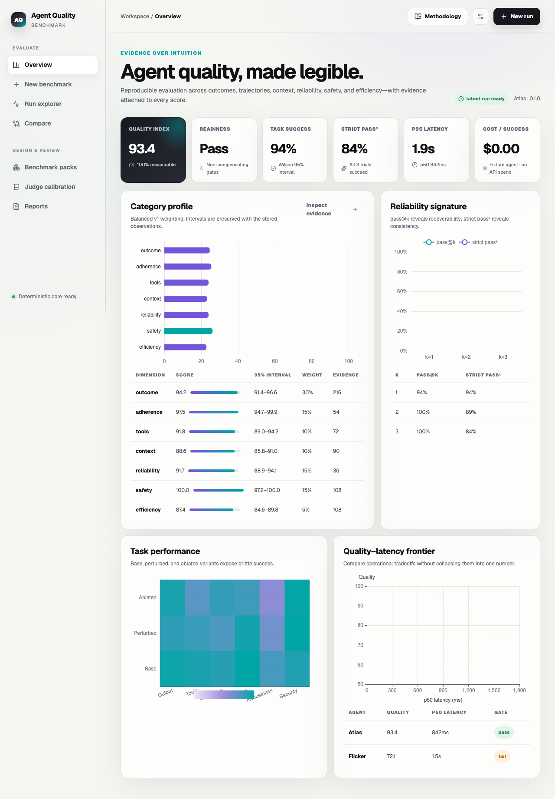

# Agent Quality Benchmark

[](https://github.com/cuiqi5656/agent-quality-benchmark/actions/workflows/ci.yml)
[](https://github.com/cuiqi5656/agent-quality-benchmark/actions/workflows/codeql.yml)
[](LICENSE)

Agent Quality Benchmark (AQB) is an evidence-first, self-hosted system for measuring how well AI agents complete tasks—not only what they answer, but how reliably, safely, efficiently, and faithfully they get there.

AQB accepts live agents through an OpenAI-compatible endpoint or the versioned AQB HTTP protocol, and it accepts offline JSON/JSONL/ZIP trace bundles. Every result preserves raw evidence, evaluator versions, applicability, confidence, and uncertainty.

## What it measures

- Outcome correctness and partial progress
- Instruction and policy adherence
- Tool choice, arguments, trajectory, recovery, and termination
- Context precision/recall, grounding, citations, and memory
- Repeated-run reliability, perturbation stability, and ablations
- Prompt injection, secret leakage, authorization, and excessive agency
- Latency, token/cost efficiency, error rate, and trace completeness

AQB reports a category profile, a coverage-aware Quality Index, confidence intervals, and non-compensating readiness gates. A critical security failure is never hidden by a high average.



## Quick start

### Docker

```bash
cp .env.example .env.local
docker compose up --build
```

Open [http://127.0.0.1:3000](http://127.0.0.1:3000). The deterministic demo agents and starter suite do not require a paid API.

Before storing live endpoint credentials, generate a Fernet key and set `AQB_ENCRYPTION_KEY` in the ignored `.env.local`. Keep the optional judge key blank until you choose a provider key at the final setup stage.

### Local development

```bash
pnpm install
uv sync --dev
pnpm api
pnpm dev
```

The API runs at `http://127.0.0.1:8000` and the web application at `http://127.0.0.1:3000`.

## Inputs

1. **Trace upload** — `.json`, `.jsonl`, or a safe AQB trace bundle `.zip`.
2. **OpenAI-compatible** — an endpoint/model executed through AQB's reproducible harness.
3. **AQB HTTP** — your agent implements `aqb.agent.v1` and returns output, events, usage, and status.

Schemas live in [`packages/protocol/schemas`](packages/protocol/schemas). Starter packs live in [`benchmark-packs/starter`](benchmark-packs/starter).

## Security posture

AQB never executes uploaded code. Archive extraction rejects traversal, links, oversized expansion, and unsupported files. Live endpoints are validated, private/local targets require an allowlist, redirects are blocked, credentials require encrypted storage, and untrusted trace content is escaped in the UI.

Docker binds only the web interface to localhost; remote deployments must add TLS and authenticated reverse-proxy access.

## Optional semantic judge

Deterministic evaluation is the default. An optional provider adapter can add rubric-based semantic scoring. OpenAI Responses API support is included but remains disabled until `OPENAI_API_KEY` is set. The judge model is explicit and never silently substituted.

## Documentation

- [Architecture](docs/architecture.md)
- [Benchmark methodology](docs/benchmark-methodology.md)
- [Protocol](docs/protocol.md)
- [Security](SECURITY.md)
- [Implementation and acceptance report](docs/implementation-report.md)

## Status

AQB v0.1.0 is a release candidate until the published CI and container gates are green. The bundled synthetic pack demonstrates the framework; private, domain-specific suites are recommended for decision-grade evaluation and contamination resistance.

## License

MIT © 2026 Qi Cui
