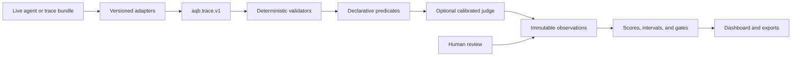

# Architecture

AQB separates observation, evaluation, persistence, and presentation so each result can be replayed and audited independently of the agent runtime.

## Monorepo boundaries

- `apps/web`: Next.js 16/TypeScript presentation and guided workflows. It uses Radix tabs, TanStack query, ECharts, Tailwind, local Geist fonts, and accessible table equivalents.
- `services/api`: FastAPI REST/SSE surface, SQLAlchemy persistence, Alembic migrations, security boundaries, uploads, comparison, calibration, and report export.
- `services/worker`: Celery execution workers. API local mode uses FastAPI background tasks for development; Compose uses Celery/Redis.
- `packages/eval-core`: reusable Python adapters, validators, statistics, scoring, runner, OpenTelemetry mapping, upload handling, and optional judge.
- `packages/protocol`: versioned JSON Schemas for agents, suites, traces, and metric observations.
- `benchmark-packs`: transparent synthetic starter suites. Private imports are recommended for decision-grade evaluation.

## Data model

Agent profiles point to encrypted credential records. Immutable suite versions contain the exact case/evaluator payload and a configuration hash. Runs retain the agent, suite, seed, repetitions, judge state, and evaluator versions. Trials retain output, final state, spans, and usage. Metric observations retain raw value/unit, definition, applicability, normalized score, interval, confidence, evidence, evaluator identity, and criticality. Human reviews and report artifacts are separate audit records.

## Execution lifecycle

1. Validate and register a live endpoint, or validate a trace bundle without executing any uploaded content.
2. Resolve an immutable suite version and capture a run manifest/idempotency key.
3. Execute base cases plus static perturbation and ablation variants with configured repetitions.
4. Evaluate with deterministic state/rule checks first, followed by declarative/model/human layers only when needed.
5. Persist observations and compute coverage, category intervals, Quality Index, reliability curves, cost, and non-compensating gates.
6. Stream state through SSE and expose the same stored evidence to the dashboard, comparisons, and exports.

## Deployment

Compose creates internal PostgreSQL and Redis services, an API, a Celery worker, and a web reverse proxy. Only `127.0.0.1:3000` is published. The artifact interface uses a local named volume; the boundary is intentionally suitable for a future S3-compatible implementation.
