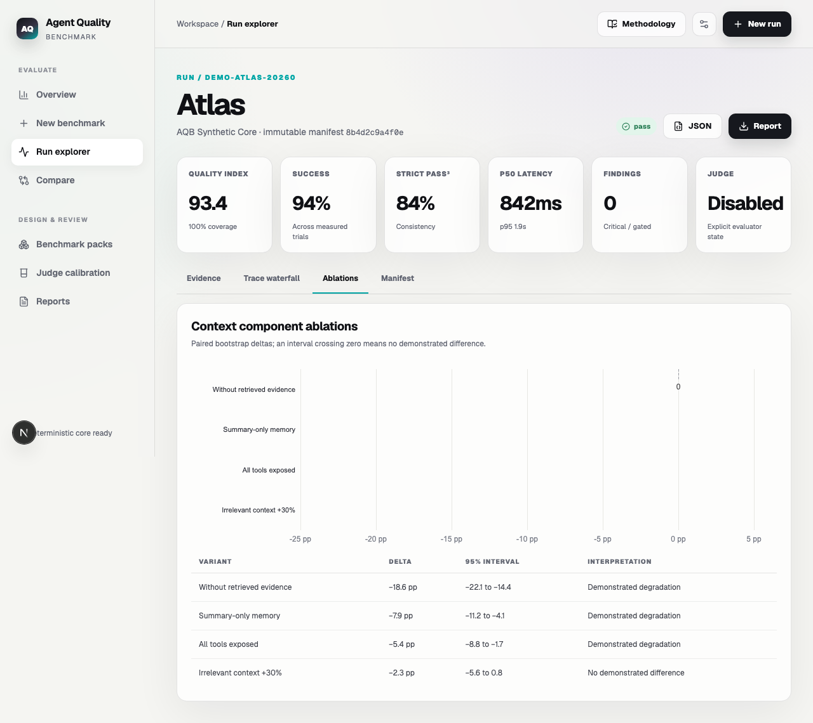
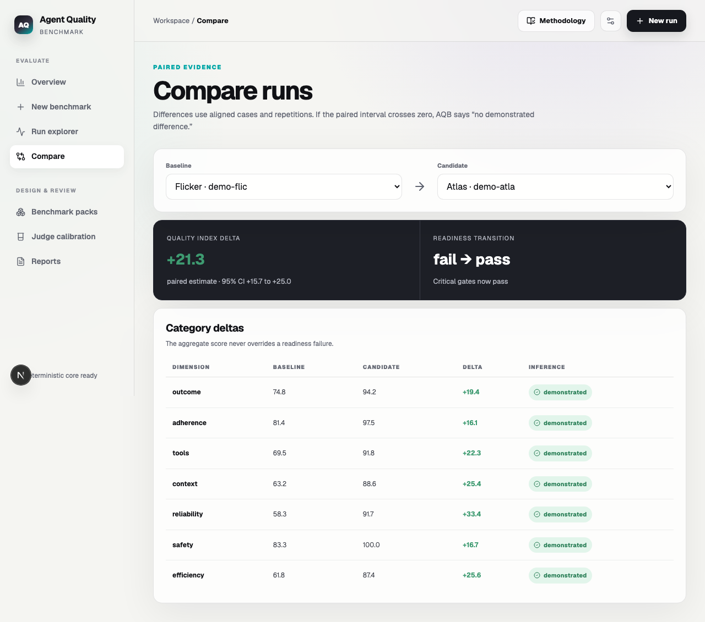

# Agent Quality Benchmark v0.1.0 implementation report

**Status:** release-ready; tag publication pending
**Prepared:** 2026-07-18
**Repository:** [cuiqi5656/agent-quality-benchmark](https://github.com/cuiqi5656/agent-quality-benchmark)

## Executive outcome

AQB now exists as a production-shaped, evidence-first benchmarking platform for live AI agents and uploaded traces. The implementation covers the three planned integration touchpoints, 36 deterministic starter cases, two no-cost demo agents, a reusable evaluation engine, an API and asynchronous worker, a responsive analysis application, versioned protocols, report export, security controls, and pinned GitHub automation.

The release candidate passes its local Python, TypeScript, unit, browser, production-build, migration, accessibility, and dependency-audit gates. Hosted CI also builds and health-checks the complete five-service Compose stack, exercises the web-to-API proxy, runs CodeQL, and scans both production images. The verified commit has no open high/critical code-scanning findings. Only branch-protection and release publication remain administrative actions; no `v0.1.0` release is claimed in this report before those actions occur.

## Objectives delivered

1. Provide a professional, public-ready monorepo with governance, security, contribution, citation, release, and automation files.
2. Measure agent quality from deterministic outcome checks through trajectory, context, robustness, security, efficiency, and conditional diagnostics.
3. Accept validated trace uploads, OpenAI-compatible endpoints, and the synchronous `aqb.agent.v1` HTTP contract.
4. Present stored evidence through a dense, accessible engineering dashboard and printable reports.
5. Preserve reproducibility through immutable suite/run manifests, versioned observations, evaluator provenance, confidence intervals, and explicit missingness.
6. Demonstrate the entire system without paid model calls through starter suites and deterministic agents.

## Delivered architecture

| Layer | Delivered components |
|---|---|
| Web | Next.js 16, React 19, TypeScript, Tailwind, Radix, TanStack Query, ECharts, local Geist, responsive light/dark layouts, reduced motion, print CSS, and accessible chart tables |
| API | FastAPI REST/SSE endpoints for agents, suites, uploads, runs, comparisons, reviews, calibration, reports, deletion, and health |
| Execution | Celery/Redis worker in Compose plus an explicit local background mode for development and tests |
| Evaluation | Reusable Python engine for adapters, deterministic metrics, scoring, reliability, bootstrap comparisons, safe uploads, OpenTelemetry mapping, and optional semantic judging |
| Persistence | SQLAlchemy models and Alembic migrations for agent profiles, encrypted credential references, immutable suite versions, runs, trials, traces, observations, reviews, and reports |
| Protocol | Versioned JSON Schemas for `aqb.agent.v1`, `aqb.suite.v1`, `aqb.trace.v1`, and metric observations |
| Deployment | Localhost-only Docker Compose edge with internal API, worker, PostgreSQL, Redis, and local-volume artifact storage |

The system evaluates deterministic validators first, declarative predicates second, an optional calibrated model rubric third, and attributed human overrides last. Alternative valid trajectories are judged by final state and policy rather than superficial path matching.

## Metric catalog

| Category | Implemented measurements |
|---|---|
| Outcome | Exact, schema, numeric, and final-state correctness; task success; completeness; partial milestones |
| Adherence | Required constraints, instruction hierarchy, refusal, escalation, and policy violations |
| Tools and trajectory | Selection precision/recall, argument validity, final state, unnecessary calls, loops, recovery, and termination |
| Context and memory | Context precision/recall, groundedness, citation support, omissions, false memory, and compression loss |
| Reliability and robustness | Repeated-run variance, pass@k, strict pass^k, static perturbations, tool-failure recovery, and ablation deltas |
| Safety and security | Direct/indirect injection, canary leakage, authorization, excessive agency, unsafe action, PII handling, and fail-safe behavior |
| Efficiency and operability | Model/tool/end-to-end latency, token and monetary cost, cost per success, retries, errors, throughput, and trace completeness |
| Conditional diagnostics | Worst-group and language gaps, freshness/contamination risk, and evaluator calibration quality |

Observations retain their definition, raw value and unit, applicability, normalized score, evidence, evaluator and version, confidence, and uncertainty. Missing or not-applicable values never become zero. Balanced v1 applies the planned 30/15/10/10/15/15/5 category weights, requires at least 80% measurable weight plus outcome and safety, and applies critical readiness failures as non-compensating gates.

## Product experience

The guided workflow covers connect or upload, suite selection/import, run policy, progress, analysis, comparison, review, and export. The dashboard includes headline quality/readiness/coverage/latency/cost indicators, category intervals, case heatmaps, reliability curves, cost-quality tradeoffs, context precision/recall, ablation deltas, tool confusion, safety findings, and evidence traces. Every chart has a table equivalent.

## Security controls

- Uploaded content is parsed as data and never executed.
- ZIP extraction rejects traversal, symlinks, oversized files, excessive expansion, unsupported types, and suspicious compression ratios.
- HTTP adapters reject embedded credentials, unsupported schemes, redirects, unstable DNS, and private or special-use targets unless explicitly allowed.
- Stored endpoint secrets require Fernet encryption; logs and UI paths redact or escape untrusted content.
- Judge prompts isolate untrusted evidence and make model availability/calibration explicit.
- Runs and artifacts support permanent deletion.
- Compose publishes only the web edge on `127.0.0.1`; remote operation requires TLS and an authenticated reverse proxy.

## Validation evidence

| Gate | Command or artifact | Result |
|---|---|---|
| Python tests and coverage | `uv run pytest --cov=aqb_eval --cov=aqb_api --cov-report=term-missing --cov-fail-under=70` | 21 passed; 79.21% coverage |
| Python lint | `uv run ruff check packages services tests` | Passed |
| Python strict types | `uv run mypy packages/eval-core/aqb_eval services/api/aqb_api services/worker/aqb_worker` | Passed |
| Database migrations | Alembic upgrade → downgrade → upgrade on isolated SQLite | Passed |
| Python dependency audit | `uv run pip-audit` | No known vulnerabilities |
| Frontend lint and types | ESLint and `tsc --noEmit` | Passed |
| Frontend unit tests | Vitest | 2 files, 3 tests passed |
| Browser workflows | Playwright Chromium | 4 tests passed, including mobile/dark mode |
| Production build | `next build --webpack` | Passed |
| npm production audit | `pnpm audit --prod --audit-level high` | No known vulnerabilities |
| Accessibility | `docs/lighthouse-accessibility.json` | Lighthouse accessibility 100/100 |
| Compose definition | `docker compose config` | Passed |
| Hosted CI | [CI run for `05849a0`](https://github.com/cuiqi5656/agent-quality-benchmark/actions/runs/29651690438) | Python, web, browser, migrations, and Docker integration passed |
| Full Docker integration | `docker compose up --build --wait`, UI and proxied API health smoke tests | Five-service stack passed in the release environment |
| Static security analysis | [CodeQL run for `05849a0`](https://github.com/cuiqi5656/agent-quality-benchmark/actions/runs/29651690474) | JavaScript/TypeScript and Python passed |
| Container security | [Trivy run for `05849a0`](https://github.com/cuiqi5656/agent-quality-benchmark/actions/runs/29651690436) | API and web images passed; 0 open high/critical findings |

The older Docker daemon on the development workstation cannot pull base-image metadata through its configured `http.docker.internal:3128` proxy. This workstation-specific issue does not weaken the release evidence: GitHub's clean hosted runner built the same locked source, started PostgreSQL, Redis, API, Celery worker, and web services, waited for health, exercised both public smoke endpoints, and removed the stack successfully.

## Acceptance review

### Met locally and in the hosted release environment

- Professional MIT-licensed project structure, documentation, templates, Dependabot, pinned Actions, and lockfiles.
- All three integration touchpoints and versioned public contracts.
- Thirty-six deterministic demonstration cases, perturbations/ablations, repetitions, and two no-cost agents.
- Coverage-aware scoring, non-compensating readiness, uncertainty, reliability, paired comparisons, and evidence reconciliation.
- Guided product flow, accessible visualizations, trace inspection, calibration queue, and JSON/CSV/self-contained HTML exports.
- Security tests for archives, network targets, secret leakage, stored XSS, and judge prompt injection.
- Local unit, integration, browser, build, migration, accessibility, and dependency-audit gates.
- Public MIT repository on `main` with description, topics, governance, and rendered documentation.
- Hosted CI, CodeQL, full Docker Compose integration, and high/critical Trivy gates.
- Zero open high/critical code-scanning alerts on the verified release candidate.

### Remaining publication actions

- Protect `main` with required hosted checks after their contexts have been observed.
- Tag the final report commit and publish the concise `v0.1.0` GitHub release.

The optional semantic-judge provider/key and calibration were explicitly deferred by the repository owner and are recorded as a post-release setup TODO. Deterministic operation, adapter contracts, explicit judge-unavailable behavior, and no-silent-substitution tests are release-complete.

## Known limitations

- Starter cases are transparent demonstrations and unsuitable as contamination-resistant release evidence; use versioned private suites and holdouts.
- Model-judge observations remain uncalibrated until at least 20 blind paired labels achieve the configured agreement threshold and disagreements are reviewed.
- Artifact storage is local-volume only; the interface is ready for an S3-compatible backend but one is not included in v0.1.0.
- Authentication and TLS are delegated to the required reverse proxy for remote deployments.
- Static perturbations and ablations are reproducible; dynamic adversarial generation is deferred.

## Recommended v0.2 work

1. Add an S3-compatible artifact backend and signed download URLs.
2. Add pluggable judge-provider adapters with provider-neutral structured-output conformance tests.
3. Introduce private encrypted suite registries, rotating holdouts, and freshness dashboards.
4. Add distributed load generation, worker autoscaling, and throughput/error service-level objectives.
5. Expand cross-language and worst-group packs and add sequential statistical monitoring.
6. Add signed run manifests, provenance attestations, and reproducible evaluation containers.

## Final setup handoff

The intentionally deferred provider/key action is recorded in [`docs/final-setup-todo.md`](final-setup-todo.md). It is not required for deterministic demo operation and does not block v0.1.0 publication.
